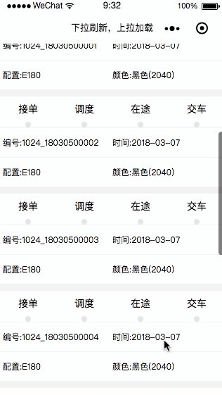

# MyJobs_WeChat
微信小程序的的各种实战demo

在这里本人将以往做过的小程序相关的项目一一做了总结，并且拆分成一个个细小的功能模块（这里包括：UI界面搭建、数据操作、用户或数据交互逻辑），封装抽类成一个个独立的功能。会把涉及到的功能点和知识点做详细的注释，便于理解、学习、使用。

## 微信小程序--下拉刷新，下拉加载  

 
 
 ### 实现功能
1. 实现了网络请求
2. 实现了下拉刷新，上拉加载更多
3. 单独的上拉加载，获取更多数据

## 微信小程序--多个button/view组件行切换时改变样式  

 
 1. 实现了购物车的尺寸或是型号选择（不可选、可单选）
 
### 详情介绍
[我的博客](http://blog.csdn.net/cituses)
[我的简书](https://www.jianshu.com/u/06c3956da505)

